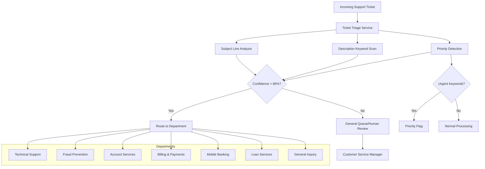

*Part of Series: [Customer Service Automation](customer-service-automation)*

## The Situation

Sarah, the Customer Experience Director at Monzo, dreads Monday mornings. Over the weekend, hundreds of support tickets pile up in the general inbox like digital tumbleweeds. "My card was declined at Starbucks AGAIN!", "How do I reset my mobile banking password?", "Someone charged $500 to my account and I don't know what it is!"

Currently, two junior support staff spend their entire Monday morning reading each ticket and manually routing them to Technical Support, Fraud Prevention, Account Services, or Billing. By the time urgent fraud alerts reach the right team, customers are already furious. Simple password resets get buried behind complex account disputes, and everything takes twice as long as it should.

Sarah knows that 80% of tickets could be instantly routed based on keywords and patterns in the subject lines and descriptions. If they could automatically sort tickets the moment they arrive, response times would drop from hours to minutes, and her support team could focus on actually helping customers instead of playing email traffic cop.

## The Challenge

### Pain Point

Manual ticket routing in customer service creates significant delays and inconsistent service quality. Studies show that 67% of customers expect their support tickets to be resolved within 4 hours, but manual triage often creates 2-3 hour delays before tickets even reach the right department. For financial institutions processing thousands of daily support requests, this bottleneck leads to customer dissatisfaction, increased escalations, and support agent burnout from handling misdirected tickets.

### Objective

Build an intelligent ticket triage system that analyzes incoming support ticket subject lines and descriptions to automatically route them to the appropriate department using keyword analysis and classification patterns.

### Requirements

- Service that accepts support ticket data and returns department routing decisions
- Classification logic for 5-7 common banking support departments
- Confidence scoring for routing decisions
- Batch processing capability for multiple tickets
- Escalation handling for ambiguous or high-priority tickets
- Support for both subject line and description analysis

### Problem Illustration



## Samples

### Inputs

```json
{
  "ticketId": "TKT-2024-15789",
  "subject": "Card declined at store but account has money",
  "description": "My debit card was declined at Target today even though I have over $500 in my checking account. This is embarrassing and I need this fixed ASAP.",
  "customerEmail": "john.doe@email.com",
  "priority": "normal",
  "timestamp": "2024-10-03T14:22:00Z"
}
```

### Outputs

```json
{
  "ticketId": "TKT-2024-15789",
  "originalSubject": "Card declined at store but account has money",
  "routedDepartment": "technical-support",
  "departmentName": "Technical Support",
  "confidence": 0.87,
  "reasoning": "Keywords: 'card declined', 'account has money' suggest card processing issue",
  "priority": "normal",
  "estimatedCategory": "card-authorization-issues",
  "suggestedTags": ["debit-card", "authorization", "merchant-decline"],
  "processingTime": "12ms"
}
```

### Sample Classifications

- "Password reset not working on mobile app" → **Technical Support** (confidence: 0.94)
- "Unauthorized charge on my statement $299" → **Fraud Prevention** (confidence: 0.91)
- "Need to update my address and phone number" → **Account Services** (confidence: 0.88)
- "Auto-pay failed for my credit card bill" → **Billing & Payments** (confidence: 0.89)
- "Loan application status inquiry" → **Loan Services** (confidence: 0.92)

### Mocks/Stubs Required

- Mock department availability/working hours (can assume all departments are available 24/7)
- Mock SLA targets per department (can use hardcoded values like "4 hours" for Technical Support)
- Mock escalation rules (can assume tickets with "urgent" keywords automatically get priority flag)

## Notes

**Real-World Considerations**: In production, you'd want to implement machine learning models trained on historical ticket routing decisions, with feedback loops for incorrect classifications. Consider implementing sentiment analysis to detect frustrated customers who need priority handling, and integration with department workload balancing to avoid overwhelming specific teams.

**If You Finish Early**: Try implementing sentiment analysis to detect angry customers and auto-escalate them, or add smart suggestions for self-service options (e.g., "This looks like a password reset - would you like to try our automated reset tool?"). You could also build a confidence threshold system where low-confidence routing decisions get reviewed by a supervisor.

**Industry Insight**: Leading customer service platforms report that automated ticket routing reduces average resolution time by 40% and increases first-contact resolution rates by 25%. The key is starting conservative with high confidence thresholds - customers prefer slightly slower routing over being bounced between departments. Most successful implementations begin with 5-6 clear department categories and expand gradually based on actual ticket patterns.