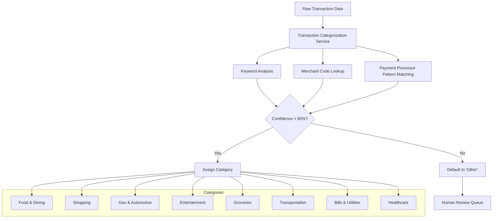

*Part of Series: [Customer Service Automation](customer-service-automation)*

## The Situation

Marcus, the Digital Banking Product Manager at Monzo, has a problem that's keeping him up at night. Their customers are constantly calling support asking, "What was that $47.23 charge from 'SQ *COFFEE CORNER NYC' anyway?" or "Why do I have so many 'Miscellaneous' transactions in my spending report?"

The raw transaction data from payment processors looks like hieroglyphics: "AMZN MKTP US*TO4A23EF5", "SQ *DOWNTOWN YOGA", "PAYPAL *SPOTIFY". Customers see these cryptic descriptions in their banking app and get frustrated because they can't track their spending patterns or understand where their money actually goes.

Marcus knows that if they could automatically transform these mysterious merchant codes into friendly categories like "Shopping", "Food & Dining", or "Entertainment", customers would love their banking app and call support 60% less often. The technology exists - they just need someone to build it.

## The Challenge

### Pain Point

Raw transaction descriptions from payment networks are notoriously cryptic and inconsistent. Research shows that 73% of banking customers struggle to understand their transaction history, leading to increased support calls and reduced engagement with digital banking tools. For banks processing millions of transactions daily, manual categorization is impossible, but accurate automated categorization can increase customer satisfaction scores by 35% and reduce support volume significantly.

### Objective

Build an intelligent transaction categorization service that analyzes raw transaction descriptions from payment processors and automatically assigns user-friendly spending categories using classification logic or mock machine learning techniques.

### Requirements

- Service that accepts raw transaction descriptions and returns categorized results
- Classification logic for 8-12 common spending categories (Food, Shopping, Gas, etc.)
- Confidence scoring for categorization decisions
- Batch processing capability for multiple transactions
- Fallback handling for unrecognizable transactions

### Problem Illustration



## Samples

### Inputs

```json
{
  "transactionId": "TXN-2024-789012",
  "description": "SQ *COFFEE CORNER NYC",
  "amount": 4.75,
  "merchantCode": "5812",
  "timestamp": "2024-10-03T08:15:00Z"
}
```

### Outputs

```json
{
  "transactionId": "TXN-2024-789012",
  "originalDescription": "SQ *COFFEE CORNER NYC",
  "category": "food-dining",
  "friendlyCategory": "Food & Dining",
  "subcategory": "coffee-shops",
  "confidence": 0.92,
  "reasoning": "Keywords: 'COFFEE', Square payment processor, MCC 5812 (restaurants)",
  "merchantName": "Coffee Corner NYC",
  "processingTime": "8ms"
}
```

### Sample Classifications

- "AMZN MKTP US*TO4A23EF5" → **Shopping** (confidence: 0.89)
- "SHELL OIL 57234Q SPRINGFIELD" → **Gas & Automotive** (confidence: 0.94)
- "SPOTIFY USA 877-778-6087" → **Entertainment** (confidence: 0.91)
- "WHOLE FOODS MKT #10140" → **Groceries** (confidence: 0.87)
- "UBER TRIP HELP.UBER.COM" → **Transportation** (confidence: 0.85)


### Mocks/Stubs Required

None

## Notes

**Real-World Considerations**: In production, you'd want to implement a feedback loop where customers can correct miscategorized transactions, and the system learns from these corrections over time. Consider adding seasonal pattern recognition (e.g., "USPS" might be "Shipping" in December but "Bills & Utilities" normally).

**If You Finish Early**: Try implementing subcategory classification (e.g., "Food & Dining" → "Fast Food" vs "Fine Dining"), or add merchant logo/icon suggestions based on recognized chains. You could also implement spending pattern analysis to catch anomalies (e.g., first-time merchant visits).

**Industry Insight**: Major fintech companies report that accurate transaction categorization increases customer engagement with budgeting features by 200% and reduces "What was this charge?" support tickets by 65%. The key is balancing automation with accuracy - customers trust the system more when it admits uncertainty rather than confidently miscategorizing.